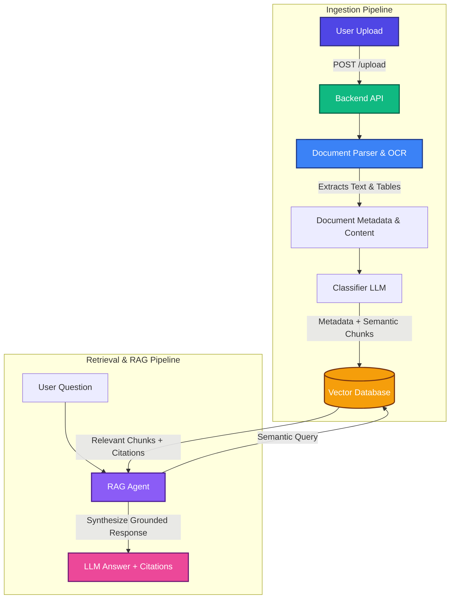

# Document Intelligence Platform

A secure, agentic Document Intelligence system that ingests complex, real-world documents (scanned PDFs, handwritten notes, tables, image-heavy reports, and long unstructured files), extracts text and structural elements, and feeds them into a Retrieval-Augmented Generation (RAG) pipeline to support citation-backed chatbot interactions.

---

## 🏗️ System Architecture

### Pipeline Flow

```
User Upload ──► Backend API ──► Document Parser (OCR/Layout) ──► Text + Images
                                                                     │
                                                                     ▼
                                                             Classifier (LLM)
                                                                     │
                                                                     ▼
                                                              Vector Database
                                                                     │
User Question ──► RAG Agent ──► Search/Retrieval ◄───────────────────┘
                    │
                    ▼
          LLM Answer + Citations (Grounded Source & Page Numbers)
```

### Flowchart Detail (Mermaid)



---

## 💡 Key Concepts

*   **RAG (Retrieval-Augmented Generation)**: A technique that retrieves relevant context from a knowledge base before passing it to the Large Language Model (LLM). This ensures the LLM's response is grounded in actual documents and minimizes hallucinations.
*   **Vector Database**: A specialized database optimized for storing and querying high-dimensional vectors representing semantic text meanings. This powers the semantic search capabilities of the chatbot.
*   **OCR (Optical Character Recognition)**: The technology used to scan and convert image-based files (scanned PDFs, handwritten pages, screenshots) into machine-readable text.
*   **Embeddings**: Mathematical vectors that represent the semantic meaning of a chunk of text, allowing the system to perform contextual similarity matching rather than simple keyword searches.

---

## 🛡️ Security Architecture

Security is integrated at every layer of the system:

1.  **Ingestion & Upload Layer**:
    *   **File Validation**: Strict verification of MIME types, magic numbers, and file sizes to prevent uploading malicious executables.
    *   **Rate Limiting**: Protection of the `/upload` endpoint from Denial of Service (DoS) attacks.
    *   **Malware Scanning**: Integration of virus scanning for uploaded documents.
2.  **Storage Layer**:
    *   **Encryption at Rest**: Files are encrypted in the local directory or cloud bucket using strong encryption standards (AES-256).
    *   **Secure Access**: Access control lists (ACLs) to ensure only authorized users can read document files.
3.  **Processing & Parse Layer**:
    *   **Isolated Sandboxing**: Document extraction and OCR run in sandboxed execution environments to prevent exploitation of parsing vulnerabilities (e.g., ImageMagick/PDF exploits).
4.  **Database & Vector Layer**:
    *   **Tenant Isolation**: Strict logical partitioning of user data within the Vector Database so users cannot query documents belonging to others.
5.  **Access Control**:
    *   **AuthN/AuthZ**: JSON Web Tokens (JWT) for secure authentication and role-based access control (RBAC).

---

## 📂 Project Structure

```
doc-intelligence/
├── backend/
│   ├── main.py          # Main FastAPI application entrypoint
│   ├── requirements.txt # Python dependencies
│   └── storage/         # Secure storage directory for uploaded files
├── frontend/            # Frontend application workspace (e.g., Next.js)
└── README.md            # Project documentation
```

---

## 🚀 Getting Started

### Prerequisites
*   Python 3.9+
*   Node.js (for the frontend)

### Backend Setup

1. Navigate to the backend directory:
   ```bash
   cd backend
   ```

2. Create a virtual environment:
   ```bash
   python -m venv venv
   source venv/bin/activate  # On Windows: venv\Scripts\activate
   ```

3. Install the dependencies:
   ```bash
   pip install -r requirements.txt
   ```

4. Run the FastAPI development server:
   ```bash
   uvicorn main.py --reload
   ```
   The API will be available at `http://localhost:8000`. You can access the Swagger UI documentation at `http://localhost:8000/docs`.
